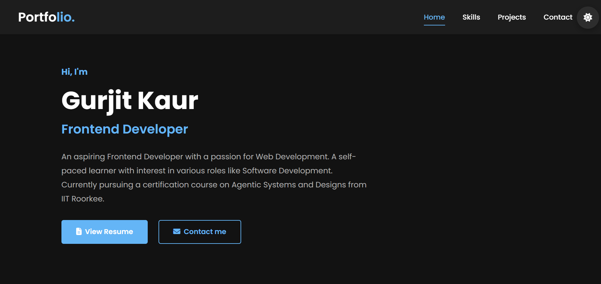

#  Portfolio Website

A modern, responsive portfolio website built with HTML, CSS, and JavaScript. Features dark/light mode toggle, contact form with EmailJS integration, and smooth animations.

##  Live Demo

[View Live Portfolio](https://your-portfolio-url.vercel.app) 

##  Features

- **Fully Responsive** - Works on all devices
- **Dark/Light Mode** - With theme persistence
- **Contact Form** - Integrated with EmailJS
- **Smooth Scrolling** - Navigation between sections
- **Typing Animation** - Dynamic job title display
- **Skills Section** - With animated progress bars
- **Projects Showcase** - Interactive project cards

##  Technologies Used

- **HTML5** - Semantic markup
- **CSS3** - Flexbox, Grid, CSS Variables
- **JavaScript (ES6+)** - Modern JavaScript
- **EmailJS** - Contact form handling

